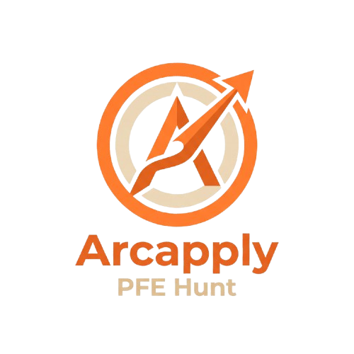

<div align="center">

  

  # ArcApply
  ### Intelligent, High-Efficiency Personal Application Copilot for Student Engineers

  **Deterministic ATS Alignment • Zero-Hallucination CV Tailoring • Sovereign & Decoupled Architecture**

  [-000000?style=for-the-badge&logo=nextdotjs&logoColor=white)](https://nextjs.org/)
  [](https://fastapi.tiangolo.com/)
  [](https://tailwindcss.com/)
  [](https://www.python.org/)
  [](https://playwright.dev/)
  [](#)

</div>

---

## 🎯 Vision & Problem Statement

Securing top-tier **PFE engineering internships** (France & Tunisia) has become a double-edged sword:
- **Generic mass-spamming** yields abysmal recruiter response rates and burns bridges with top firms.
- **Uncontrolled GenAI tools** hallucinate experiences, alter real dates, invent fictional skills, and produce generic boilerplate cover letters immediately flagged by automated hiring pipelines.
- **ATS (Applicant Tracking Systems)** reject qualified candidates whose resumes lack keyword alignment and semantic hierarchy matching the job offer.

**ArcApply** was engineered to solve this paradigm. It acts as an autonomous cockpit that pairs candidate sovereignty with deterministic intelligence — adapting CVs and synthesis letters exclusively against a verified Master Profile, matching real keywords against job specifications, and automating application lifecycle tracking without black-box randomness.

---

## ✨ Core Highlights & Technical Capabilities

### 🛡️ 1. Zero-Hallucination Integrity Guard (CAP-1 Invariant)
- **Strict Grounding:** The CV synthesis engine is mathematically constrained to the candidate's verified **Master Profile**.
- **No Fictional Skills:** If a skill or technology is not part of the candidate's real journey, the system will never extrapolate or invent it, preserving 100% recruiter trust.
- **Completeness Guard:** Automated gatekeeping checks ensure complete identity, education, experiences, and technical competencies before generating tailored assets.

### 🎯 2. Deterministic ATS Scoring & Keyword Alignment
- **Heuristic & Keyword Engine:** Parses job offers to extract required technical competencies, languages, methodologies, and framework requirements.
- **Dynamic Prioritization:** Re-orders and highlights real matching candidate experiences, projects, and skills to maximize keyword overlap against automated ATS parsers.
- **Objective Score Breakdown:** Provides actionable alignment percentages based on hard technical requirements rather than opaque statistical guesses.

### 🗂️ 3. 10 Normalized Technical Skill Categories
Organizes technical stacks into 10 industry-standard disciplines, rendered distinctly on dedicated lines both in the candidate cockpit and on compiled resumes:
1. **Frameworks** *(FastAPI, React, Next.js, Spring Boot, etc.)*
2. **Langages & Scripting** *(Python, TypeScript, Go, Bash, Rust, etc.)*
3. **Bases de données** *(PostgreSQL, Redis, MongoDB, SQLite, etc.)*
4. **Versioning & Méthodes** *(Git, GitHub Actions, Scrum, Agile, CI/CD, etc.)*
5. **Systèmes & Réseaux** *(Linux, Debian, TCP/IP, DNS, Nginx, etc.)*
6. **Monitoring & Observabilité** *(Prometheus, Grafana, OpenTelemetry, etc.)*
7. **Infrastructure as Code** *(Terraform, Ansible, Pulumi, etc.)*
8. **Cloud & Infrastructure** *(AWS, GCP, Azure, Scaleway, etc.)*
9. **Conteneurisation & Orchestration** *(Docker, Docker Compose, Kubernetes, Helm, etc.)*
10. **Sécurité (DevSecOps)** *(OWASP Top 10, SonarQube, Trivy, Vault, etc.)*

### 🌐 4. Native Bilingual Generation (🇫🇷 Français & 🇬🇧 English)
- **Dual-Field Profile Architecture:** Stores parallel French and English descriptions, roles, degrees, project highlights, and summaries.
- **Global Context Switcher:** A single top-level language switch propagates seamlessly across the entire application.
- **Instant Localized Generation:** Produces fully tailored French or English CVs and bespoke cover letters without manual translation or re-formatting.

### 📄 5. Pixel-Perfect Vector PDF Compilation
- **Headless Browser Rendering:** Uses headless Playwright to compile clean, print-accurate A4 vector PDFs.
- **No Canvas/Raster Artifacts:** High-density, crystal-clear typography, selectable text, and clean page-budget enforcement.
- **ATS Parsing Optimization:** Single-column layout engineered for high ATS parsing accuracy across Workday, Taleo, Greenhouse, and Lever.

### ✉️ 6. Anti-Cliché Cover Letter Synthesizer
- **4-Part Structured Synthesis:** Generates high-impact motivation letters following the proven **VOUS / MOI / NOUS / DEMAIN** architecture.
- **Defensive LLM Pipeline:** Integrates high-speed Groq inference with strict token management (`max_tokens <= 450`) and an instant deterministic fallback engine to guarantee zero downtime.
- **Cliché Scoring:** Built-in heuristic detector flags tired recruitment jargon and hollow claims.

### 👥 7. Strict Multi-Tenant Data Isolation
- **Sovereign User Segregation:** Offers scraped by one student engineer remain strictly private and isolated.
- **Zero Cross-Contamination:** Authentication guards enforce tenant isolation across every REST endpoint, database query, and preview generation pipeline.

### 🕹️ 8. Human-in-the-Loop Application Lifecycle (FSM)
- Strict Finite State Machine enforcing conscious, intentional progress:
  $$\text{DISCOVERED} \longrightarrow \text{REVIEWING} \longrightarrow \text{READY} \longrightarrow \text{SUBMITTED} \longrightarrow \text{INTERVIEW} \longrightarrow \text{OFFER} \text{ / } \text{REJECTED}$$
- **Irreversible Submission Guard:** 5-second countdown with immediate cancellation prevents accidental status transitions.

---

## 🏗️ System Architecture

ArcApply follows strict architectural decoupling (**AD-1** & **AD-2**):

```
┌────────────────────────────────────────────────────────┐
│                   ArcApply Cockpit                     │
│    Next.js 15 (App Router) • React 19 • Tailwind CSS   │
│   Sleek Artisan UI • Bilingual Switcher • TanStack     │
└───────────────────────────┬────────────────────────────┘
                            │ REST / JSON (JWT + Tenant Headers)
┌───────────────────────────▼────────────────────────────┐
│              Backend LangGraph AI Engine               │
│         FastAPI 0.115 • Python 3.12 • Pydantic v2      │
│  ────────────────────────────────────────────────────  │
│   • LangGraph Multi-Agent Architecture:                │
│     - Agent 1: Deep Recon Scout (Playwright + Recon)   │
│     - Agent 2: Strategic Writer (Thinking ➔ Drafting) │
│   • Candidate Playbook of Natural Language Directives  │
│   • ATS Keyword Alignment    • Groq LLM Synthesizer    │
│   • Multi-Tenant Auth Guard  • Playwright Vector PDF   │
└───────────────────────────┬────────────────────────────┘
                            │
┌───────────────────────────▼────────────────────────────┐
│                   Data Persistence                     │
│         SQLite with SQLModel / Idempotent Migrations   │
│                 ~/.arcapply/arcapply.db                │
└────────────────────────────────────────────────────────┘
```

- **Next.js Web Cockpit:** Handles reactive user experiences, real-time status updates, bilingual interfaces, and live editing. Never touches heavy automation subprocesses directly.
- **FastAPI Core Engine:** Exclusively owns business logic, database migrations, LLM calls, Playwright headless execution, and ATS parsing algorithms.
- **SQLite via SQLModel:** Zero-dependency, file-based database providing complete local data sovereignty.

---

## 🎨 UI & UX Philosophy

- **Artisan Aesthetic:** Warm editorial palette (`#F7F3EC`), refined typography, and purposeful micro-interactions.
- **Live Split-Pane Drawer:** Review ATS alignment scores, tailored resume PDF previews, and cover letters side-by-side with the original job description.
- **Interactive Competency Matrix:** Rapid inline tag management across the 10 core technical disciplines with one-touch addition.

---

## 🔒 Security & Privacy

- **100% Data Sovereignty:** Candidate records, application history, and notes live in the candidate's private local environment.
- **Zero Third-Party Data Scraping:** No candidate data is sold, monetized, or trained on public AI models.
- **Strict Tenant Enclosure:** All queries are filtered through cryptographic token verification and username ownership invariants.

---

<div align="center">
  <sub>Designed & Developed with precision for engineering excellence.</sub>
</div>
