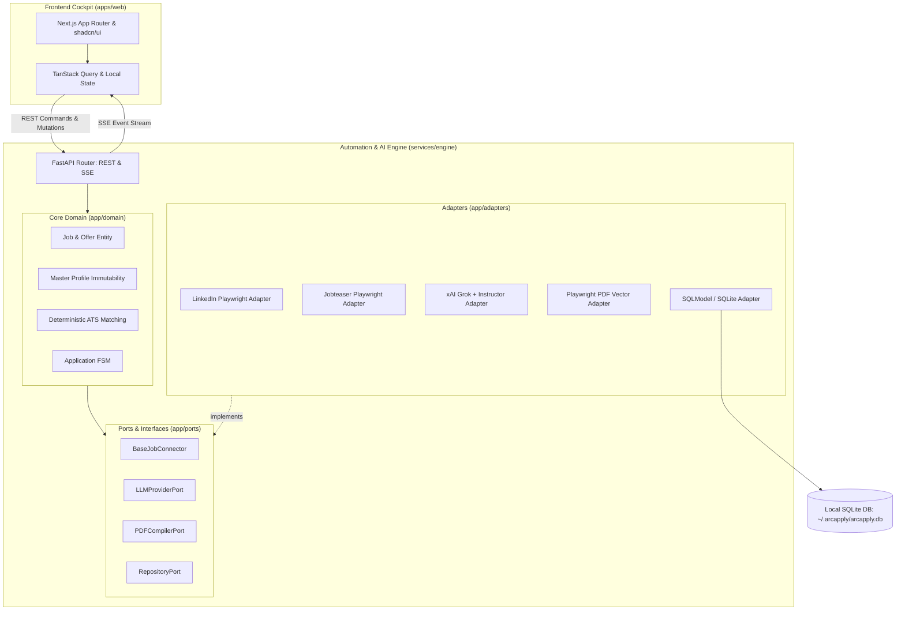

# Architecture Spine — ArcApply

## Design Paradigm

ArcApply adopts a **Decoupled Hexagonal / Ports-and-Adapters Architecture** separating a high-reactivity Web Cockpit (Next.js) from a resilient Local Automation & AI Engine (FastAPI / Python).



### Namespace / Directory Layout

- **`apps/web/`** : Cockpit web Next.js
  - `app/` : Routes App Router (`/`, `/radar`, `/kanban`, `/profile`, `/settings`)
  - `components/` : Composants UI `shadcn/ui`, `ats-score-badge`, `review-drawer`, `kanban-board`
  - `hooks/` : Hooks React (`useSSE`, `useKeyboardShortcuts`, `useKanban`)
  - `lib/api/` : Client HTTP typé consommant l'API Engine
- **`services/engine/`** : Moteur Python FastAPI
  - `app/domain/` : Entités métier pures (Job, MasterProfile, Application, ATSMatchResult)
  - `app/ports/` : Contrats et classes abstraites d'interfaces (`BaseJobConnector`, `LLMClientPort`)
  - `app/adapters/` : Connecteurs Playwright, client Grok/Instructor, compilateur PDF, repository SQLite
  - `app/api/` : Endpoints REST (`/api/jobs`, `/api/applications`, `/api/profile`) et flux SSE (`/api/events`)
  - `app/config.py` : Configuration de l'environnement local et chemins sécurisés

---

## Invariants & Rules

### AD-1 — Découplage strict Cockpit Frontend et Moteur Backend

- **Binds:** `apps/web`, `services/engine`
- **Prevents:** Le gel ou crash de l'interface utilisateur lors d'opérations lourdes de scraping (Playwright), de sessions browser longues ou d'appels LLM réseau.
- **Rule:** Le frontend Next.js et l'engine FastAPI s'exécutent dans deux processus distincts. Le frontend ne lance aucun sous-processus système lourd et n'embarque aucune dépendance Playwright/Python ; toutes les opérations de détection, parsing, et génération sont déléguées au moteur via l'API.

### AD-2 — Propriété exclusive de la persistance par le Moteur

- **Binds:** Base SQLite, schéma de données, `services/engine`
- **Prevents:** Les verrous concurrents SQLite (*database is locked*), les divergences de schéma et les écritures concurrentes non contrôlées.
- **Rule:** L'engine FastAPI est l'unique propriétaire du fichier de base de données SQLite local (`~/.arcapply/arcapply.db`). Le frontend Next.js ne lit ni n'écrit jamais directement dans SQLite ; toute lecture et mutation transite obligatoirement par les endpoints HTTP/REST de l'engine.

### AD-3 — Protocole de communication REST + SSE

- **Binds:** Communication inter-processus `apps/web` <-> `services/engine`
- **Prevents:** La surcharge d'un serveur WebSocket bidirectionnel complet tout en évitant le polling agressif (HTTP spam) pour suivre le scraping et la progression LLM.
- **Rule:** Les commandes unitaires et mutations d'état (CRUD profil, validation de candidature, archivage d'offre) utilisent HTTP REST standard avec codes statut explicites. La télémétrie asynchrone (avancement de l'adaptation en 3 étapes, logs de scraping en direct, alertes de session expirée) est transmise exclusivement par Server-Sent Events (SSE) via `/api/events` avec une enveloppe JSON stricte : `{"event": "<EVENT_NAME>", "timestamp": "<ISO8601>", "payload": { ... }}`.

### AD-4 — Pipeline IA Anti-hallucination déterministe en 3 étapes

- **Binds:** Module LLM, adaptation CV, génération de lettre, calcul de score ATS
- **Prevents:** Toute invention ou extrapolation de compétence, expérience ou formation non attestée dans le Master Profile de l'étudiant.
- **Rule:** Tout traitement LLM d'une offre obéit strictement au pipeline suivant :
  1. *Extraction structurée* : L'offre brute est parsée vers un modèle Pydantic typé `JobRequirements` via `instructor` + Grok.
  2. *Matching déterministe (hors LLM)* : Un algorithme en code Python pur calcule l'intersection sémantique et lexicale entre `JobRequirements` et `MasterProfile`. Les compétences absentes sont isolées dans `missing_skills` et formellement proscrites.
  3. *Génération contrainte* : Le prompt de génération de la lettre et d'ordonnancement du CV ne reçoit en contexte QUE les fragments du profil explicitement validés à l'étape 2. Le système interdit l'injection de tout texte du profil complet non validé.

### AD-5 — Strategy / Plugin Pattern pour les Connecteurs de Recrutement

- **Binds:** Connecteurs LinkedIn, Jobteaser, et futures plateformes d'offres
- **Prevents:** L'enchevêtrement du code de scraping avec la logique métier et l'impossibilité pour des contributeurs open-source d'ajouter de nouvelles plateformes proprement.
- **Rule:** Tout connecteur d'offres hérite obligatoirement de la classe abstraite `BaseJobConnector` et implémente `authenticate_session()`, `search_jobs()`, `fetch_job_details()`, et `prepare_application()`. Les sélecteurs DOM et spécificités Playwright sont strictement encapsulés dans leur dossier d'adaptateur respectif (`app/adapters/connectors/<provider>/`).

### AD-6 — Machine à états finis des candidatures & Sas de validation humaine

- **Binds:** Kanban, workflow de candidature, API applications
- **Prevents:** L'envoi automatique sauvage sans consentement de l'étudiant et les états de candidatures incohérents.
- **Rule:** Le cycle de vie d'une offre suit rigoureusement la machine à états finis :
  `DISCOVERED` $\rightarrow$ `REVIEWING` $\rightarrow$ `READY` $\rightarrow$ `SUBMITTED` $\rightarrow$ `INTERVIEW` $\rightarrow$ `OFFER` (ou `REJECTED`).
  Le passage à l'état `SUBMITTED` exige obligatoirement un passage préalable par `READY` et une confirmation humaine explicite. Toute transition invalide (ex: passage direct de `DISCOVERED` à `SUBMITTED`) est rejetée au niveau du service backend avec une erreur HTTP 422 Unprocessable Entity. Le délai d'annulation de 5 secondes est orchestré côté frontend (UI optimiste) avant l'émission de la requête de soumission définitive.

### AD-7 — Génération de CV vectoriel ATS via Playwright

- **Binds:** Compilateur PDF, export de candidature
- **Prevents:** L'installation de bibliothèques C système complexes (Cairo, Pango) ou l'incompatibilité avec les parseurs ATS due à des PDF matriciels ou mal structurés.
- **Rule:** Le CV adapté est rendu sous forme de page HTML/CSS standardisée conforme au design system, puis compilé en PDF vectoriel avec texte sélectionnable natif via `page.pdf()` de Playwright en mémoire. Les styles d'impression forcent une mise en page sobre, sans colonnes complexes susceptibles de perturber les ATS.

### AD-8 — Isolation locale des secrets et des sessions

- **Binds:** Stockage de clés API, cookies de plateformes, sécurité de l'hôte
- **Prevents:** La fuite accidentelle de cookies de session LinkedIn/Jobteaser ou de clés API dans les dépôts Git.
- **Rule:** Aucun secret ni cookie d'authentification n'est stocké dans l'arbre source du projet. Les données d'exécution persistantes, cookies de navigation chiffrés et la base de données résident exclusivement dans le répertoire utilisateur `~/.arcapply/`.

---

## Consistency Conventions

| Préoccupation | Convention retenue |
| --- | --- |
| **Identifiants uniques** | UUIDv7 pour toutes les entités primaires (`job_id`, `application_id`, `profile_item_id`) pour tri temporel naturel et unicité décentralisée. |
| **Horodatage & Dates** | ISO 8601 UTC (`YYYY-MM-DDTHH:MM:SSZ`) sur toutes les interfaces REST et en base de données. |
| **Formats d'erreurs d'API** | RFC 7807 (Problem Details) avec code d'erreur applicatif typé (`error_code`, `message`, `details`). |
| **Conventions de nommage** | `snake_case` pour les attributs JSON d'API et les champs Python/Pydantic ; `camelCase` pour le code TypeScript frontend ; `kebab-case` pour les noms de fichiers et routes. |
| **Contrats de données Polyglottes** | Le schéma OpenAPI généré par FastAPI (`/openapi.json`) fait foi ; les types TypeScript côté `apps/web/lib/api/types.ts` sont synchronisés via `openapi-typescript`. |
| **Gestion des mutations** | Mutations idempotent-safe : mise à jour d'un statut avec horodatage et version d'état. |
| **Gestion des logs** | Logs structurés JSON côté Python (via `structlog` ou `loguru`) avec contextualisation (`job_id`, `connector`). |

---

## Stack

| Composant | Rôle | Version validée |
| --- | --- | --- |
| **Python** | Runtime du moteur d'automatisation & backend | `3.12+` |
| **FastAPI** | Framework Web REST & SSE | `0.115+` |
| **Pydantic** | Validation de schémas et typage de données | `2.10+` |
| **SQLModel / SQLAlchemy** | ORM et gestionnaire de persistance SQLite | `0.0.22+` / `2.0+` |
| **Instructor (Python)** | Encodage de sorties structurées LLM sans hallucination | `1.7+` |
| **Playwright Python** | Scraping résilient, automatisation et compilation PDF | `1.50+` |
| **uv** | Gestionnaire ultra-rapide de packages et d'environnements Python | `0.5+` |
| **Node.js** | Runtime pour le cockpit web | `22 LTS` |
| **Next.js** | Framework web frontend (App Router) | `15.2+` |
| **React** | Bibliothèque UI réactive | `19.0+` |
| **Tailwind CSS** | Moteur de styles utilitaires conforme au DESIGN.md | `3.4+` |
| **shadcn/ui & Radix UI** | Primitives d'interface et d'accessibilité WCAG AA | `Dernières versions stables` |
| **TanStack Query** | Gestionnaire de cache et synchronisation d'état serveur | `5.60+` |
| **xAI Grok API** | Modèle LLM d'extraction et de synthèse assistée | `grok-beta` / `grok-2` |

---

## Structural Seed

Structure d'arborescence minimale initiale du projet :

```
arcapply/
├── apps/
│   └── web/                     # Frontend Next.js Cockpit
│       ├── app/                 # App Router (routes, layouts)
│       ├── components/          # Composants UI (review-drawer, ats-badge, kanban)
│       ├── hooks/               # useSSE, useKeyboardNav
│       ├── lib/                 # Utilitaires & client API
│       ├── package.json
│       └── tsconfig.json
├── services/
│   └── engine/                  # Backend FastAPI & Automatisation
│       ├── app/
│       │   ├── domain/          # Entités métier pures (Job, Profile, Application)
│       │   ├── ports/           # Interfaces abstraites (BaseJobConnector, LLMPort)
│       │   ├── adapters/        # Connecteurs LinkedIn/Jobteaser, Grok, PDF, SQLite
│       │   ├── api/             # Routes REST et SSE FastAPI
│       │   ├── main.py          # Point d'entrée de l'application FastAPI
│       │   └── config.py        # Configuration et chemins (~/.arcapply)
│       ├── pyproject.toml       # Dépendances Python managées par uv
│       └── tests/
├── scripts/
│   └── dev.sh                   # Script de lancement orchestré front + back
├── README.md
└── .gitignore
```

---

## Operational & Environmental Envelope

- **Environnement d'exécution cible** : Poste local de travail de l'étudiant (macOS / Linux / Windows WSL2) en mode mono-utilisateur.
- **Démarrage & Cycle de vie local** : Un script unifié `scripts/dev.sh` (ou Makefile / `concurrently`) lance simultanément `uv run uvicorn app.main:app --port 8000` et `pnpm --filter web dev --port 3000`.
- **Sauvegarde et Portabilité** : Les données utilisateur (`arcapply.db`, fichiers exportés) peuvent être exportées en un clic depuis l'interface sous forme d'archive JSON/Zip chiffrée pour réinstallation ou archivage de fin de campagne.
- **Résilience aux pannes réseau** : En cas de coupure Internet ou d'indisponibilité de l'API LLM, l'interface bascule en mode consultation locale dégradée avec message clair, sans perte de données.

---

## Deferred

Points volontairement différés aux itérations ultérieures (non bloquants pour le build initial du MVP) :
1. **Multi-comptes et authentification centralisée** : Le MVP est strictement mono-utilisateur local-first ; le support OAuth multi-utilisateurs est différé à la V2 open-source.
2. **Support d'autres modèles LLM locaux (Ollama / vLLM)** : L'architecture via `LLMProviderPort` permet l'ajout ultérieur d'un modèle local sans impacter le domaine.
3. **Connecteurs de plateformes supplémentaires** : Welcome to the Jungle, Moovijob et Indeed seront implémentés via l'interface `BaseJobConnector` lors des phases d'extension.
4. **Conteneurisation Docker complète** : Optionnelle pour le MVP personnel, différée à la distribution communautaire.
